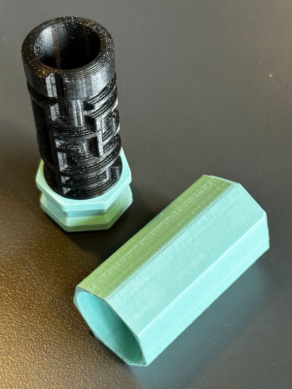

# Cylinder labyrinter til workshop om Escape

Kan genereres på: https://www.me.uk/puzzlebox/
 - Brug parametre nedenfor

Efterfølgende skal den genererede fil åbnes i openScad, som kan hentes her: https://openscad.org/
 - Installer openSCAD
 - Åben den genererede og downloadede fil i OpenSCAD
 - Vælg i menu: Design-> Render (eller tryk F6)
 - Når den er genereret, vælg i menu: File -> Export -> Export as STL... (F7)
 - Importer i slicer til 3D-print

Til dem vi har genereret til workshoppen har vi brugt følgende parametre. Det kan være at du f.eks. skal ændre "General X/Y clearance", der bestemmer afstanden mellem indre og ydre del.
- Total parts: m=2
- Part to make: n=0 (alle dele) n=1 (indre del) n=2 (ydre del)
- Nubs: N=1
- Base height: b=15
- Core diameter: c=16
- Core height: h=60
- Base thickness: B=1.6mm
- Base gap: G=0.4mm
- Wall thickness: w=1.2mm
- Maze thickness: t=2mm
- Base spacing: z=5mm
- Maze top margin: M=1mm
- Maze complexity: X=1 (vi brugte værdier fra 0 til 5)
- Thickness park ridge: p=0.7mm
- General X/Y clearance: g=0.1mm
- Number of outer sides: s=7
- Outer rounding ends: r=2
- Grip depth: R=2
